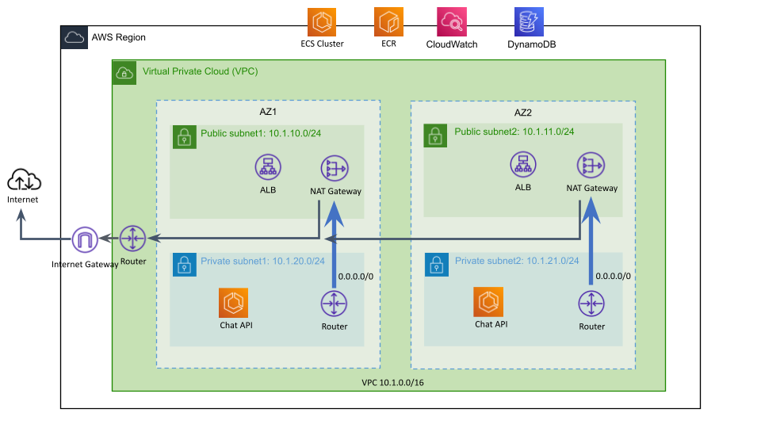

# Chat API with OpenAI Integration, Persistent Chat Threads, and A/B Testing

This document describes the proposed design for a containerized NestJS-based Chat API that integrates with OpenAI's Chat Completions API (with function calling), persists chat threads in DynamoDB, and supports A/B testing of different configurations via load balancer routing.

## Assumptions
The following assumptions have been made:

- We’re using OpenAI’s API to query the LLM that powers the agent
- The problem of guardrails and content filtering is handled by an external service.
- A notification and theme service are available for invocation to perform authenticated user actions
- Cloud Platform Provider:
    - The existing application lives in AWS
- Availability: 
    - Must be resilient to an AWS availability zone (AZ) outage, multi-region support not required
- Users:
    - Number of users using the application: < 1M
    - User locale: North America
    - Users have some max number of chats and daily tokens
    - Users would be rate limited if they send excessive messages
- OpenAI API Integration:
    - The OpenAI Chat Completions API supports both token streaming and function calling reliably.
	- The API returns properly formatted JSON for function calls (with a function_call field and JSON-formatted arguments).
	- Network latency and API rate limits are within acceptable bounds for real-time chat.
- Authentication & Authorization:
    - Users authenticate via JWT, and a Passport JWT strategy is in place to validate tokens.
	- The authenticated user object includes a unique identifier (e.g., id) used to associate chat messages with a user.
- Containerized Deployment:
    - The NestJS application is containerized and deployed using orchestration platforms such as AWS Fargate/ECS
	- The deployment environment supports environment variable configuration for sensitive values (e.g., OpenAI API key, model parameters).
- Chat Persistence in DynamoDB:
	- DynamoDB’s eventual consistency and throughput are adequate for the expected chat workload.
- Operational Considerations:
    - Monitoring, logging, and error tracking (e.g., using CloudWatch, Prometheus, or similar tools) will be implemented to track system performance and user engagement.

## Design Overview

The system provides a chat interface where users can send messages and receive token-by-token streamed responses. Based on user requests, the chat agent can also trigger authenticated actions such as:
- Changing notification settings
- Switching the application appearance (light/dark mode)

Key features include:
- **Real-Time Streaming:** Server-Sent Events (SSE) are used to stream tokens from OpenAI to the client.
- **Authentication:** The API is secured with JWT (using Passport and a JWT strategy).
- **Persistent Chat Threads:** Chat messages are stored in a DynamoDB table.
- **A/B Testing:** Different deployment configurations (e.g., model, temperature, system prompt) can be evaluated by routing traffic to separate deployments using a load balancer with session affinity.
- **Function Calling:** OpenAI's function calling feature is integrated to trigger back-end actions based on chat context.

## System Architecture


### Containerized NestJS Application
- **API Layer:**  
  The NestJS application exposes REST endpoints (e.g., `POST /chat`) and uses SSE to stream responses.
- **Authentication:**  
  JWT-based authentication is enforced using Passport.
- **OpenAI Integration:**  
  The application communicates with the OpenAI Chat Completions API using streaming and supports function calling for specific actions.
- **Persistent Storage:**  
  Chat messages are persisted in a DynamoDB table with a flexible schema for high scalability and low latency.
- **A/B Testing:**  
  A load balancer routes traffic to different deployments (variants) using weighted routing and sticky sessions.
- **Deployment:**
  Deployed across multiple availability zones for redundancy

### Load Balancer & Session Affinity
- **Weighted Routing:**  
  A load balancer (AWS ALB) distributes traffic between different deployments running variant A, B, etc...
- **Sticky Sessions:**  
  Cookie-based session affinity ensures that users are consistently routed to the same deployment during a session.

## Chat API

#### `POST /chat`
- **Description:**  
  Accepts a chat message from an authenticated user, stores the user's message, streams the assistant's response via SSE, and persists the assistant's final response.
- **Security:**  
  Protected by JWT via Passport.
- **Request Body (JSON):**
  - `conversationId` (optional): Unique identifier for the conversation; if omitted, a new conversation is created.
  - `message`: The user's message.
  - `resumeToken` (optional): Token to resume a previously interrupted streaming session.
- **Response:**  
  Streams tokens and function call events using Server-Sent Events (SSE).


### Chat API OpenAPI Specification
```yaml
openapi: 3.0.0
info:
  title: Chat API
  version: "1.0.0"
  description: >
    A simple chat API for interacting with an AI agent.
    The API supports sending messages via /chat, retrieving full conversations via /conversations/{conversationId},
    and listing all conversation IDs for the authenticated user with pagination.
servers:
  - url: https://api.example.com
    description: Production server

paths:
  /chat:
    post:
      summary: Send a chat message and receive a streaming response.
      operationId: sendChatMessage
      requestBody:
        description: The user message and conversation context.
        required: true
        content:
          application/json:
            schema:
              $ref: '#/components/schemas/ChatRequest'
      responses:
        '200':
          description: Streamed chat response tokens.
          content:
            text/event-stream:
              schema:
                type: string
                example: |
                  data: {"token": "Hello"}
                  data: {"token": ", how"}
                  data: {"token": " can I help you today?"}
        '400':
          description: Invalid request.
          content:
            application/json:
              schema:
                $ref: '#/components/schemas/ErrorResponse'
        '401':
          description: Unauthorized.
          content:
            application/json:
              schema:
                $ref: '#/components/schemas/ErrorResponse'
      security:
        - bearerAuth: []

  /conversations:
    get:
      summary: Retrieve a list of conversation IDs for the authenticated user.
      operationId: getUserConversationIds
      parameters:
        - name: limit
          in: query
          description: Maximum number of conversation IDs to return.
          required: false
          schema:
            type: integer
            default: 50
        - name: nextToken
          in: query
          description: Token to retrieve the next page of results.
          required: false
          schema:
            type: string
      responses:
        '200':
          description: A list of conversation IDs for the user.
          content:
            application/json:
              schema:
                type: object
                properties:
                  conversationIds:
                    type: array
                    items:
                      type: string
                  nextToken:
                    type: string
                    description: A token for retrieving the next page of results.
        '401':
          description: Unauthorized.
          content:
            application/json:
              schema:
                $ref: '#/components/schemas/ErrorResponse'
      security:
        - bearerAuth: []

  /conversations/{conversationId}:
    get:
      summary: Retrieve all messages for a specific conversation.
      operationId: getConversationMessages
      parameters:
        - name: conversationId
          in: path
          description: Unique identifier for the conversation.
          required: true
          schema:
            type: string
        - name: limit
          in: query
          description: Maximum number of messages to return.
          required: false
          schema:
            type: integer
            default: 50
        - name: nextToken
          in: query
          description: Token to retrieve the next page of messages.
          required: false
          schema:
            type: string
      responses:
        '200':
          description: A list of chat messages for the conversation with pagination details.
          content:
            application/json:
              schema:
                type: object
                properties:
                  messages:
                    type: array
                    items:
                      $ref: '#/components/schemas/ChatMessage'
                  nextToken:
                    type: string
                    description: A token for retrieving the next page of results.
        '401':
          description: Unauthorized.
          content:
            application/json:
              schema:
                $ref: '#/components/schemas/ErrorResponse'
      security:
        - bearerAuth: []

components:
  schemas:
    ChatRequest:
      type: object
      properties:
        conversationId:
          type: string
          description: >
            Unique identifier for the conversation.
            If omitted, a new conversation will be created.
        message:
          type: string
          description: The user's message.
        resumeToken:
          type: integer
          description: Optional token to resume a previously interrupted streaming session.
      required:
        - message
    ChatMessage:
      type: object
      properties:
        conversationId:
          type: string
          description: Unique identifier for the conversation.
        messageTimestamp:
          type: number
          description: Unix epoch timestamp (in milliseconds) when the message was created.
        userId:
          type: string
          description: Identifier of the user associated with the message.
        sender:
          type: string
          description: Indicates the origin of the message (e.g., "user" or "assistant").
        content:
          type: string
          description: The text content or payload of the message.
        metadata:
          type: object
          additionalProperties: true
          description: Optional additional details for the message.
    ErrorResponse:
      type: object
      properties:
        error:
          type: string
          description: Error message.
  securitySchemes:
    bearerAuth:
      type: http
      scheme: bearer
      bearerFormat: JWT
```

### Chat API Code Snippets

#### File Structure
```
src/
 ├── app.module.ts
 ├── main.ts
 └── chat/
      ├── chat.controller.ts
      ├── chat.service.ts
      └── dto/
            └── chat-request.dto.ts
            └──  chat-message-response.dto.ts
```

#### src/app.module.ts
```typescript
import { Module } from '@nestjs/common';
import { ChatController } from './chat/chat.controller';
import { ChatService } from './chat/chat.service';

@Module({
  imports: [],
  controllers: [ChatController],
  providers: [ChatService],
})
export class AppModule {}
```

#### src/main.ts
```typescript
import { NestFactory } from '@nestjs/core';
import { AppModule } from './app.module';

async function bootstrap() {
  const app = await NestFactory.create(AppModule);
  // Optionally enable CORS and other middleware as needed
  await app.listen(3000);
  console.log(`Application is running on: ${await app.getUrl()}`);
}
bootstrap();
```

#### src/chat/dto/chat-request.dto.ts
```typescript
export class ChatRequest {
  /**
   * Unique identifier for the conversation.
   * If omitted, a new conversation will be created.
   */
  conversationId?: string;

  /**
   * The user's message.
   */
  message: string;

  /**
   * Optional token to resume a previously interrupted streaming session.
   */
  resumeToken?: number;
}
```

#### src/chat/dto/chat-message-response.dto.ts
```typescript
export class ChatMessageResponseDto {

  conversationId: string;

  messageTimestamp: number;

  userId: string;

  sender: string; // e.g., 'user' or 'assistant'

  content: string;

  metadata?: Record<string, any>;
}
```

#### src/chat/chat.service.ts
```typescript
import { Injectable } from '@nestjs/common';
import { Observable } from 'rxjs';
import { ChatRequest } from './dto/chat-request.dto';
import axios from 'axios';
import { NotificationService } from '../notification/notification.service';
import { ThemeService } from '../theme/theme.service';

@Injectable()
export class ChatService {
  constructor(
    private readonly notificationService: NotificationService,
    private readonly themeService: ThemeService
  ) {}

  /**
   * Uses OpenAI's Chat Completions API with function calling enabled to stream tokens.
   * Returns an Observable that emits each token or function call as they are received.
   */
  getChatStream(chatRequest: ChatRequest): Observable<any> {
    return new Observable(observer => {
      // Use environment variables for configuration with fallback defaults.
      const model = process.env.OPENAI_MODEL || 'gpt-3.5-turbo';
      const temperature = process.env.OPENAI_TEMPERATURE
        ? parseFloat(process.env.OPENAI_TEMPERATURE)
        : 0.7;
      const systemPrompt = process.env.OPENAI_SYSTEM_PROMPT || 'You are a helpful assistant.';

      // Prepare the conversation messages.
      const messages = [
        { role: 'system', content: systemPrompt },
        { role: 'user', content: chatRequest.message }
      ];

      // Define functions for OpenAI's function calling.
      const functions = [
        {
          name: "change_notification_settings",
          description: "Change the user's notification settings.",
          parameters: {
            type: "object",
            properties: {
              enabled: {
                type: "boolean",
                description: "True to enable notifications, false to disable them."
              }
            },
            required: ["enabled"]
          }
        },
        {
          name: "switch_theme",
          description: "Switch the application appearance between light and dark mode.",
          parameters: {
            type: "object",
            properties: {
              theme: {
                type: "string",
                enum: ["light", "dark"],
                description: "The theme to switch to."
              }
            },
            required: ["theme"]
          }
        }
      ];

      const requestBody = {
        model,
        messages,
        temperature,
        stream: true,
        functions,
        function_call: "auto" // Let OpenAI decide if a function call should be made.
      };

      // Make the POST request to OpenAI's Chat Completions API.
      axios({
        method: 'post',
        url: 'https://api.openai.com/v1/chat/completions',
        data: requestBody,
        responseType: 'stream',
        headers: {
          'Content-Type': 'application/json',
          'Authorization': `Bearer ${process.env.OPENAI_API_KEY}`,
        },
      })
        .then(response => {
          const stream = response.data;
          let buffer = '';

          stream.on('data', (chunk: Buffer) => {
            buffer += chunk.toString();
            // OpenAI sends responses with newlines separating JSON payloads.
            const lines = buffer.split('\n');
            buffer = lines.pop() || '';
            for (const line of lines) {
              if (line.startsWith('data: ')) {
                const data = line.replace(/^data: /, '').trim();
                if (data === '[DONE]') {
                  observer.complete();
                  return;
                }
                try {
                  const parsed = JSON.parse(data);
                  const choice = parsed.choices[0];

                  // Check if the response indicates a function call.
                  if (choice.finish_reason === "function_call" && choice.message.function_call) {
                    const { name, arguments: args } = choice.message.function_call;
                    const parsedArgs = JSON.parse(args);
                    // Invoke the function asynchronously and stream the result.
                    this.invokeFunction(name, parsedArgs)
                      .then(result => {
                        observer.next({ function_call: { name, arguments: parsedArgs, result } });
                      })
                      .catch(err => {
                        observer.next({ function_call: { name, arguments: parsedArgs, error: err.message } });
                      });
                  } else {
                    // Otherwise, stream the text token.
                    const token = choice.delta?.content;
                    if (token) {
                      observer.next({ token });
                    }
                  }
                } catch (err) {
                  console.error('Error parsing stream data:', err);
                }
              }
            }
          });

          stream.on('end', () => {
            observer.complete();
          });

          stream.on('error', (err: Error) => {
            observer.error(err);
          });
        })
        .catch(err => {
          observer.error(err);
        });

      // Optional cleanup logic when unsubscribing.
      return () => {
        // For example, abort the HTTP request if needed.
      };
    });
  }

  /**
   * Invokes a function based on the provided name and arguments.
   * Assumes that the application has APIs or services available to handle these actions.
   *
   * @param name The name of the function to invoke.
   * @param args The arguments for the function.
   * @returns A promise that resolves with the result of the invocation.
   */
  async invokeFunction(name: string, args: any): Promise<any> {
    // For demonstration purposes, assume we have a user ID.
    // In practice, you might extract the user context from the request/session.
    const userId = 'example-user-id';

    if (name === 'change_notification_settings') {
      // Call the notification service to update the user's settings.
      try {
        const result = await this.notificationService.updateSettings(userId, args.enabled);
        return { success: true, data: result };
      } catch (error) {
        throw new Error(`Failed to update notification settings: ${error.message}`);
      }
    } else if (name === 'switch_theme') {
      // Call the theme service to switch the user's theme.
      try {
        const result = await this.themeService.switchTheme(userId, args.theme);
        return { success: true, data: result };
      } catch (error) {
        throw new Error(`Failed to switch theme: ${error.message}`);
      }
    } else {
      throw new Error(`Unknown function: ${name}`);
    }
  }
}
```

#### src/chat/chat.controller.ts
```typescript
import { Controller, Post, Body, Res, UseGuards, Req } from '@nestjs/common';
import { Request, Response } from 'express';
import { ChatService } from './chat.service';
import { ChatRequest } from './dto/chat-request.dto';
import { AuthGuard } from '@nestjs/passport';
import { saveChatMessage } from '../dynamodb/chat.repository';
import { v4 as uuidv4 } from 'uuid';

@Controller('chat')
@UseGuards(AuthGuard('jwt'))
export class ChatController {
  constructor(private readonly chatService: ChatService) {}

  /**
   * POST /chat
   * Accepts a chat message from an authenticated user,
   * saves the user message, streams the assistant response via SSE,
   * and then saves the final assistant message.
   */
  @Post()
  async sendChatMessage(
    @Req() req: Request,
    @Body() chatRequest: ChatRequest,
    @Res() res: Response
  ) {
    // Extract user ID from the authenticated request.
    // (Assumes that the JWT strategy attaches a user object with an 'id' property.)
    const userId = req.user?.id;
    if (!userId) {
      res.status(401).send({ error: 'Unauthorized' });
      return;
    }

    // If no conversationId is provided, generate a new one.
    let conversationId = chatRequest.conversationId || uuidv4();
    chatRequest.conversationId = conversationId;

    // Save the user's message in DynamoDB.
    await saveChatMessage({
      conversationId,
      messageTimestamp: Date.now(),
      userId,
      sender: 'user',
      content: chatRequest.message,
    });

    // Set headers for Server-Sent Events (SSE).
    res.setHeader('Content-Type', 'text/event-stream');
    res.setHeader('Cache-Control', 'no-cache');
    res.setHeader('Connection', 'keep-alive');
    res.flushHeaders();

    // We'll accumulate the assistant's response tokens.
    let assistantMessage = '';

    // Obtain the streaming response from the ChatService.
    const stream$ = this.chatService.getChatStream(chatRequest);

    stream$.subscribe({
      next: async (data) => {
        // If we received a token, send it to the client and accumulate it.
        if (data.token) {
          res.write(`data: ${JSON.stringify(data)}\n\n`);
          assistantMessage += data.token;
        }
        // Optionally, if a function call is returned, send that info as well.
        else if (data.function_call) {
          res.write(`data: ${JSON.stringify(data)}\n\n`);
        }
      },
      error: (err) => {
        res.write(`data: ${JSON.stringify({ error: err.message })}\n\n`);
        res.end();
      },
      complete: async () => {
        // Once the stream is complete, save the full assistant message.
        await saveChatMessage({
          conversationId,
          messageTimestamp: Date.now(),
          userId,
          sender: 'assistant',
          content: assistantMessage,
        });
        // Inform the client that the stream is complete.
        res.write(`data: ${JSON.stringify({ message: 'complete' })}\n\n`);
        res.end();
      },
    });
  }
}
```

## OpenAI Integration with Function Calling

- **Function Definitions:**  
  Two functions are defined:
  - `change_notification_settings` – updates user notification settings.
  - `switch_theme` – switches the application appearance between light and dark modes.
- **Behavior:**  
  The API sets `function_call` to `"auto"`, so OpenAI can suggest when to call a function. When a function call is detected, the application:
  1. Parses the function name and arguments.
  2. Routes the call to internal services (e.g., NotificationService, ThemeService).
  3. Returns the result to the client as part of the streamed response.

## Persistent Chat Threads in DynamoDB
For a chat application where users return to their conversation threads and it primarily retrieves messages by conversation ID in chronological order, DynamoDB is a great choice due to its scalability and low-latency performance. Complex queries were not anticipated for the specified use cases.

### Data Model

- **Primary Key:**
  - `conversationId` (String): Partition key.
  - `messageTimestamp` (Number): Sort key (Unix epoch in milliseconds).
- **Attributes:**
  - `userId` (String): Identifier for the user owning the conversation.
  - `sender` (String): Indicates the message source ("user", "assistant", "system").
  - `content` (String): The message text or payload.
  - `metadata` (Map, Optional): Additional context (e.g., function call details).

### Example CloudFormation Snippet

```yaml
Resources:
  ChatThreadsTable:
    Type: AWS::DynamoDB::Table
    Properties:
      TableName: ChatThreads
      BillingMode: PAY_PER_REQUEST
      AttributeDefinitions:
        - AttributeName: conversationId
          AttributeType: S
        - AttributeName: messageTimestamp
          AttributeType: N
        - AttributeName: userId
          AttributeType: S
      KeySchema:
        - AttributeName: conversationId
          KeyType: HASH
        - AttributeName: messageTimestamp
          KeyType: RANGE
      GlobalSecondaryIndexes:
        - IndexName: UserConversationsIndex
          KeySchema:
            - AttributeName: userId
              KeyType: HASH
            - AttributeName: conversationId
              KeyType: RANGE
          Projection:
            ProjectionType: ALL
```
### Data Access Code Snippets

#### Saving a Chat Message
```typescript
import { DynamoDBClient } from '@aws-sdk/client-dynamodb';
import { DynamoDBDocumentClient, PutCommand } from '@aws-sdk/lib-dynamodb';

const client = new DynamoDBClient({});
const ddbDocClient = DynamoDBDocumentClient.from(client, {
  marshallOptions: { removeUndefinedValues: true },
});

const TABLE_NAME = process.env.CHAT_THREADS_TABLE || 'ChatThreads';

export interface ChatMessage {
  conversationId: string;
  messageTimestamp: number; // Unix epoch in milliseconds
  userId: string;
  sender: string; // e.g., "user", "assistant", "system"
  content: string;
  metadata?: Record<string, any>;
}

export async function saveChatMessage(chatMessage: ChatMessage): Promise<void> {
  const params = {
    TableName: TABLE_NAME,
    Item: chatMessage,
  };

  try {
    await ddbDocClient.send(new PutCommand(params));
    console.log(`Message saved for conversation ${chatMessage.conversationId}`);
  } catch (error) {
    console.error('Error saving chat message:', error);
    throw error;
  }
}
```

#### Querying Conversations:
```typescript
import { DynamoDBClient } from '@aws-sdk/client-dynamodb';
import { DynamoDBDocumentClient, QueryCommand } from '@aws-sdk/lib-dynamodb';

const client = new DynamoDBClient({});
const ddbDocClient = DynamoDBDocumentClient.from(client, {
  marshallOptions: { removeUndefinedValues: true },
});

const TABLE_NAME = process.env.CHAT_THREADS_TABLE || 'ChatThreads';

export async function queryUserConversations(userId: string): Promise<any[]> {
  const params = {
    TableName: TABLE_NAME,
    IndexName: 'UserConversationsIndex', // Defined in your CloudFormation template
    KeyConditionExpression: 'userId = :uid',
    ExpressionAttributeValues: {
      ':uid': userId,
    },
  };

  try {
    const result = await ddbDocClient.send(new QueryCommand(params));
    console.log(`Found ${result.Items?.length || 0} items for user ${userId}`);
    return result.Items || [];
  } catch (error) {
    console.error('Error querying user conversations:', error);
    throw error;
  }
}
```

## Deployment

The NestJS application is containerized using Docker and deployed on AWS ECS. This configuration provides session affinity at the load balancer level, ensuring a consistent experience for users while still leveraging multi-AZ deployments for high availability and scalability. Assume that environment variables will be configured as needed.

- Automated Evals
    - Eval benchmarks could be run prior to deployment, e.g. OpenAI Evals
- Staging Environment
    - A `staging` environment could be deployed for internal testing that requires team approval prior to deployment into `prod`

### CloudFormation Snippet
```yaml
Resources:
  # ECS Cluster
  ECSCluster:
    Type: AWS::ECS::Cluster
    Properties:
      ClusterName: MyECSCluster

  # Task Definition for Fargate
  MyTaskDefinition:
    Type: AWS::ECS::TaskDefinition
    Properties:
      Family: my-ecs-task
      Cpu: "256"
      Memory: "512"
      NetworkMode: awsvpc
      RequiresCompatibilities:
        - FARGATE
      ContainerDefinitions:
        - Name: my-app
          Image: mydockerimage:latest
          PortMappings:
            - ContainerPort: 80
              Protocol: tcp
          Essential: true

  # Application Load Balancer (spanning multiple AZs)
  MyALB:
    Type: AWS::ElasticLoadBalancingV2::LoadBalancer
    Properties:
      Name: my-alb
      Scheme: internet-facing
      Subnets:
        - !Ref PublicSubnet1  # Subnets must be in different AZs.
        - !Ref PublicSubnet2
        - !Ref PublicSubnet3
      SecurityGroups:
        - !Ref ALBSecurityGroup

  # Target Group for the ECS Service with Sticky Sessions enabled
  MyTargetGroup:
    Type: AWS::ElasticLoadBalancingV2::TargetGroup
    Properties:
      Name: my-target-group
      Port: 80
      Protocol: HTTP
      VpcId: !Ref VPC
      TargetType: ip
      HealthCheckProtocol: HTTP
      HealthCheckPort: "80"
      HealthCheckPath: "/health"
      Matcher:
        HttpCode: "200"
      TargetGroupAttributes:
        - Key: stickiness.enabled
          Value: "true"
        - Key: stickiness.type
          Value: "lb_cookie"
        - Key: stickiness.lb_cookie.duration_seconds
          Value: "86400"  # 24 hours in seconds

  # Listener for the ALB
  MyListener:
    Type: AWS::ElasticLoadBalancingV2::Listener
    Properties:
      LoadBalancerArn: !Ref MyALB
      Port: 80
      Protocol: HTTP
      DefaultActions:
        - Type: forward
          TargetGroupArn: !Ref MyTargetGroup

  # ECS Service deployed on Fargate across multiple private subnets (AZs)
  MyService:
    Type: AWS::ECS::Service
    DependsOn: MyListener
    Properties:
      ServiceName: my-ecs-service
      Cluster: !Ref ECSCluster
      LaunchType: FARGATE
      TaskDefinition: !Ref MyTaskDefinition
      DesiredCount: 2
      NetworkConfiguration:
        AwsvpcConfiguration:
          AssignPublicIp: ENABLED
          Subnets:
            - !Ref PrivateSubnet1  # Private subnets in different AZs
            - !Ref PrivateSubnet2
            - !Ref PrivateSubnet3
          SecurityGroups:
            - !Ref ECSServiceSecurityGroup
      LoadBalancers:
        - ContainerName: my-app
          ContainerPort: 80
          TargetGroupArn: !Ref MyTargetGroup
      DeploymentConfiguration:
        MaximumPercent: 200
        MinimumHealthyPercent: 50
```
- TargetGroupAttributes:
    - The properties stickiness.enabled, stickiness.type, and stickiness.lb_cookie.duration_seconds are added to enable ALB-based session affinity. This configuration ensures that once a user is routed to a target, subsequent requests from that user are directed to the same target for 24 hours.
- ALB and Subnets:
    - The Application Load Balancer spans multiple public subnets in different Availability Zones, ensuring high availability.
- ECS Service:
    - The service is deployed across multiple private subnets (each in different AZs) so that tasks are distributed evenly, while the ALB (with sticky sessions enabled) routes user traffic consistently to the same task.


## A/B Testing with Load Balancer Routing

### Multi-Faceted Approach
 - Multiple Deployments:
    - Deploy variant A (default configuration) and variant B (modified parameters) as separate deployments.
- Weighted Routing:
    - The load balancer routes traffic between deployments based on configurable weights.
- Session Affinity:
    - Sticky sessions ensure that each user consistently accesses the same variant during a session.
- Metrics and Feedback:
    - Collect both passive engagement metrics and direct user feedback (e.g., thumbs up/down) to evaluate performance.

### Example Weighted Routing Using AWS ALB
```yaml
ListenerRules:
  - RulePriority: 1
    Conditions:
      - Field: path-pattern
        Values: ['/chat*']
    Actions:
      - Type: forward
        ForwardConfig:
          TargetGroups:
            - TargetGroupArn: arn:aws:elasticloadbalancing:region:account-id:targetgroup/chat-api-variant-A/abcdef
              Weight: 50
            - TargetGroupArn: arn:aws:elasticloadbalancing:region:account-id:targetgroup/chat-api-variant-B/ghijkl
              Weight: 50
```


## React Front End Component
To facilitate easy integration across the web application, a reusable React frontend component could be used:
```typescript
import React, { useState } from 'react';

const ChatWidget = ({ apiEndpoint, authToken }) => {
  const [input, setInput] = useState('');
  const [chatLog, setChatLog] = useState([]);
  const [isStreaming, setIsStreaming] = useState(false);

  const handleSend = async () => {
    // Append user's message to chat log.
    setChatLog((prev) => [...prev, { sender: 'user', message: input }]);
    setIsStreaming(true);

    try {
      const response = await fetch(apiEndpoint, {
        method: 'POST',
        headers: {
          'Content-Type': 'application/json',
          ...(authToken && { 'Authorization': `Bearer ${authToken}` }),
        },
        body: JSON.stringify({ message: input }),
      });

      if (!response.ok) {
        console.error('Error sending message', response.statusText);
        setIsStreaming(false);
        return;
      }

      const reader = response.body.getReader();
      const decoder = new TextDecoder('utf-8');
      let buffer = '';

      while (true) {
        const { done, value } = await reader.read();
        if (done) break;
        buffer += decoder.decode(value, { stream: true });
        
        // Split on newline to get SSE events.
        const lines = buffer.split('\n');
        // If the last line is not complete, keep it in the buffer.
        buffer = lines.pop() || '';

        lines.forEach((line) => {
          if (line.startsWith('data: ')) {
            const dataStr = line.slice(6).trim();
            if (dataStr === '[DONE]') {
              setIsStreaming(false);
            } else {
              try {
                const data = JSON.parse(dataStr);
                // Update the chat log with each token or message.
                if (data.token) {
                  setChatLog((prev) => [...prev, { sender: 'assistant', message: data.token }]);
                } else if (data.message) {
                  setChatLog((prev) => [...prev, { sender: 'assistant', message: data.message }]);
                }
              } catch (err) {
                console.error('Failed to parse SSE data:', err, line);
              }
            }
          }
        });
      }
    } catch (err) {
      console.error('Error during chat streaming:', err);
    }
    setIsStreaming(false);
    setInput('');
  };

  return (
    <div style={{ maxWidth: '600px', margin: '0 auto' }}>
      <div
        style={{
          border: '1px solid #ccc',
          padding: '10px',
          height: '300px',
          overflowY: 'scroll',
          marginBottom: '10px',
        }}
      >
        {chatLog.map((entry, index) => (
          <div
            key={index}
            style={{ textAlign: entry.sender === 'user' ? 'right' : 'left', margin: '5px 0' }}
          >
            <strong>{entry.sender}:</strong> {entry.message}
          </div>
        ))}
      </div>
      <div>
        <input
          type="text"
          placeholder="Type your message..."
          value={input}
          onChange={(e) => setInput(e.target.value)}
          disabled={isStreaming}
          style={{ width: '80%', padding: '8px' }}
        />
        <button onClick={handleSend} disabled={isStreaming || !input.trim()} style={{ padding: '8px 12px' }}>
          Send
        </button>
      </div>
    </div>
  );
};

export default ChatWidget;
```


## Summary
This design offers a robust, scalable, and flexible solution for a chat agent that:
- Streams responses in real time via SSE.
- Integrates seamlessly with OpenAI’s Chat Completions API (with function calling).
- Persists chat history in DynamoDB for later retrieval.
- Supports A/B testing via a load balancer with sticky sessions.
- Is containerized for deployment on modern orchestration platforms.

This comprehensive architecture meets the requirements for delivering a high-quality AI agent interface within an existing application while providing the ability to evolve and optimize the system through continuous A/B testing and user feedback.


## Future Enhancements

### Functionality Enhancements
- **Robust Error Handling:** Implement retry logic, fallback behaviors, and graceful degradation for API failures.
- **Context Managment:** Handle context sizes that exceeds model maximum
- **Enhanced Conversation Context:** Improve state management and resume capabilities for long sessions.
- **Centralized Logging & Monitoring:** Integrate structured logging, dashboards, and automated alerting.
- **User Feedback Integration:** Develop mechanisms to capture and analyze user feedback (e.g., thumbs up/down).
- **Data Retention & Management:** Define and automate archiving/purging strategies for chat logs in DynamoDB.
- **RAG:** Leverage retrieval-augmented-generation to answer user questions with proprietary data
- **Auto Deployment:** Improve A/B Testing Framework: Consider automated optimization (e.g., using machine learning) to dynamically adjust configuration parameters based on real-time feedback.
- **Multimodal Interaction:**  Explore support for voice, video, or other interaction modalities to provide a richer and more accessible user experience.

### Security Enhancements
- **Input Validation & Sanitization:** Strengthen validation to mitigate XSS, injection, and other vulnerabilities.
- **Function Call Safeguards:** Validate and sanitize function call parameters to prevent unauthorized actions.
- **Rate Limiting & Throttling:** Introduce request limits per user/IP to reduce the risk of DoS attacks.
- **Secure Secrets Management:** Utilize solutions like AWS Secrets Manager for handling sensitive credentials.
- **Least Privilege IAM Policies:** Refine access controls for DynamoDB and other AWS resources.
- **Enforce TLS/SSL:** Ensure all communication channels (client-ALB, ALB-ECS) are secured.
- **Container Hardening:** Adopt best practices for container security, including vulnerability scanning and runtime monitoring.


## Alternate Design Considerations: API Gateway and Lambda

An alternative approach considered for this project was to build the chat API using AWS API Gateway in combination with AWS Lambda functions and Cognito. In this design, API Gateway would handle incoming HTTP/WebSocket requests and route them to Lambda functions that would execute the chat logic, including streaming tokens from the OpenAI API.

### Key Characteristics 

- **Serverless Architecture:**  
  Leveraging Lambda functions eliminates the need to manage servers, automatically scaling with demand.

- **Managed Connectivity:**  
  API Gateway would provide built-in support for authentication (e.g., using AWS Cognito or custom Lambda authorizers) and routing.

- **Event-Driven Execution:**  
  Lambda functions would process chat messages and stream responses token-by-token using a serverless model.

### Challenges and Reasons for Not Choosing This Approach

- **Long-Lived Streaming Limitations:**  
  - Lambda functions have a maximum execution time (up to 15 minutes), which complicates the implementation of continuous, long-lived streaming sessions.
  - Workarounds such as checkpointing and client-side reconnection add complexity and potential reliability issues.

- **Cold Start Latency:**  
  - Lambda functions can experience cold starts, which may introduce unwanted latency in a real-time chat environment.

- **State Management Complexity:**  
  - Maintaining conversational context and managing session state across multiple Lambda invocations can be challenging, especially when combined with streaming responses.

- **Operational Tradeoffs:**  
  - While the serverless model reduces infrastructure management, the added complexity in code (to overcome Lambda limitations) makes the system harder to maintain and debug.

### Conclusion

Although the API Gateway + Lambda design offers advantages in scalability and operational simplicity for certain workloads, its limitations around long-lived streaming and stateful interactions made it less suitable for our real-time chat application. For this reason, we opted for a containerized NestJS solution, which provides persistent connections, simpler state management, and better support for our A/B testing.


## References & Resources
1. ChatGPT, o3-mini-high used as a design partner to discuss and evaluate design options
2. OpenAI Chat API https://platform.openai.com/docs/api-reference/chat/create
3. OpenAI Function Calling https://platform.openai.com/docs/guides/function-calling 
4. NestJS Docs https://docs.nestjs.com/ 
5. DynamoDB Docs https://docs.aws.amazon.com/AWSJavaScriptSDK/v3/latest/client/dynamodb/
6. NestJS + OpenAI authN solution https://medium.com/paktolus-engineering/leveraging-ai-power-a-comprehensive-guide-to-integrating-openai-with-nestjs-1c7c772e96fd 
7. NextJS, NestJS, OpenAI Streaming https://blog.stackademic.com/unlocking-stream-capabilities-in-openai-chat-integration-d9ab49c4659d 